Note: This DCF is based on a DCF tutorial done by ['rareliquid'](https://www.youtube.com/watch?v=fmoE3H8RjP4&list=PL71QplJWp1Rpzqr4q1nq5b4Im93JkGcwm&index=29) 

Please see the completed Excel file here: [Excel_for_DCF](2024.08.-DCF-Tutorial-Part-1.xlsx)

# Initial Excel Template
The Excel includes tabs with financial data for the fiscal years 2014-2024:
- CapEx, Cash Flow Statement, Income Statement, Segment Income Statement

The Excel also includes a tab with templates for DCF, WACC, and Share Count Calculation to be used in making the DCF Valuation for the firm.

# Building DCF Template
Starting with a blank sheet, we can follow these steps to make the basic DCF template:

## Format Revenue Section

- We have sales by segment for 2014-2023 and then projected sales by segment for 2024-2029, so we can start by pulling these sales figures.

    - Since we are pulling these numbers from another sheet, we color them green.

- We also label actual years with an 'A' (ex. 2015A) and projected years with an 'E' (ex. 2026E)
 
- Since sales in AWS are 0 in 2014, we will remove this year so we can include AWS sales in our model

- After adding in sales, we can then sum these three segments to find total sales per year. We also add a _% growth_ row to find how much sales grew for each segment by year.

    - The _% growth_ row is colored black since the figures are calculated.
    - After finding total sales, we can also add a _% of total sales_ column.

- After completing these steps, the revenue section looks like this:

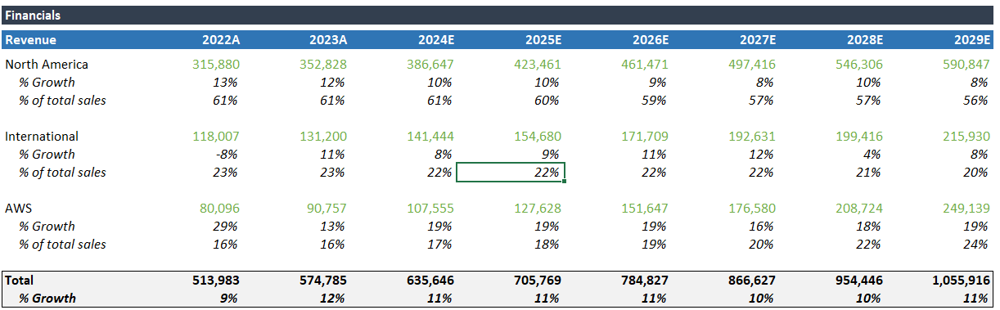

## EBIT Section
This section pulls from the same segment-level data as the revenue section. The only difference is that _% growth_ is now _% sales_ and _% of total sales_ is _% of total EBIT_.

- There is no projection data for 2027-2029 for the North America and International segments. We can estimate these figures by keeping the % sales rate the same as the previous year (2026).

    - Since these numbers are our own estimates, we can call attention to this by coloring them red.

- After completing these steps, the revenue section looks like this:

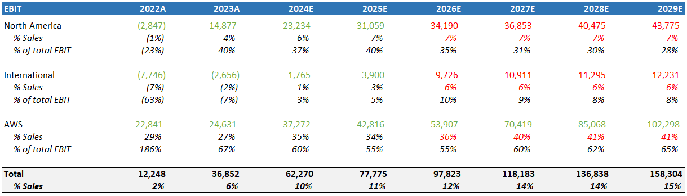

## Additional Sections
After making these first two sections, we can then use the templates that we have made to add additional sections needed for the DCF calculations

### Taxes

To find the numbers for the tax section, we have to look in the income statement. We can pull the amount of taxes paid by year and then divide this number by the pretax income to find the _% tax rate_.

- For years where Amazon has a cash inflow from taxes, the tax rate is not listed. This is done using this formula, where C42 is the taxes paid that year by Amazon:

```excel
=IF(C42<0,"--",IS!C31/IS!C30)
```

We do not have tax data past 2024, so we will use a 5-year average of the % tax rate to project taxes for 2025-2029 to end up with this:

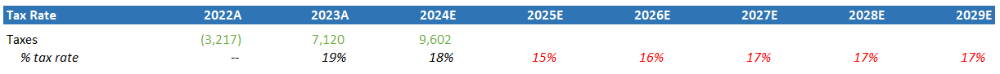

### Cash Flow Items
Unsurprisingly, the figures in this section come from the Statement of Cash Flows. In this section, these are the items:
- Depreciation & Amortization (D&A)
    - With _% of sales_ and _% of CapEx_
- Capital Expenditures (CapEx)
    - With _% of sales_ 
    - I have multiplied all of these numbers by -1 to keep them positive in my model since they are listed as cash outflows on the CFS
- Change in Net Working Capital (NWC)
    - With _% of sales_ and _% of change in sales_

### Projecting 2025-2029 for Cash Flow Items
Since we only have data up to 2024 for the Statement of Cash Flows, we will have to project out future growth of these three categories. Looking at the calculated percentages, we can then pick the most consistent one for each category to project out data past 2024.

- Depreciation & Amortization (D&A)


    - Use the 5-year average of _% of sales_

- Capital Expenditures (CapEx)

    - Use the 5-year average of _% of sales_
- Change in Net Working Capital (NWC)

- Use the 5-year average of _% of sales_


After doing these projections, this is what years 2025-2029 look like:

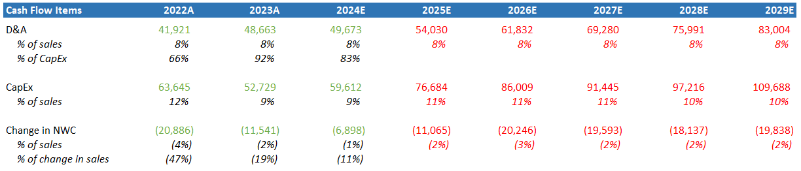

### DCF Section

Now that we have all of the needed financial information, we can make the DCF section with rows for:

- Revenue
- EBIT
- D&A
- CapEx
- Change in NWC

Since we already have these numbers listed above, we can just pull from those.

These numbers will be colored purple to denote that they are from the same sheet.

We can also use the tax rate we predicted for 2025-2029 to find numbers for these rows, where the tax rate * EBIT gets us the estimated taxes paid for the year:
- Taxes
- EBIAT

All filled out, it looks like this:

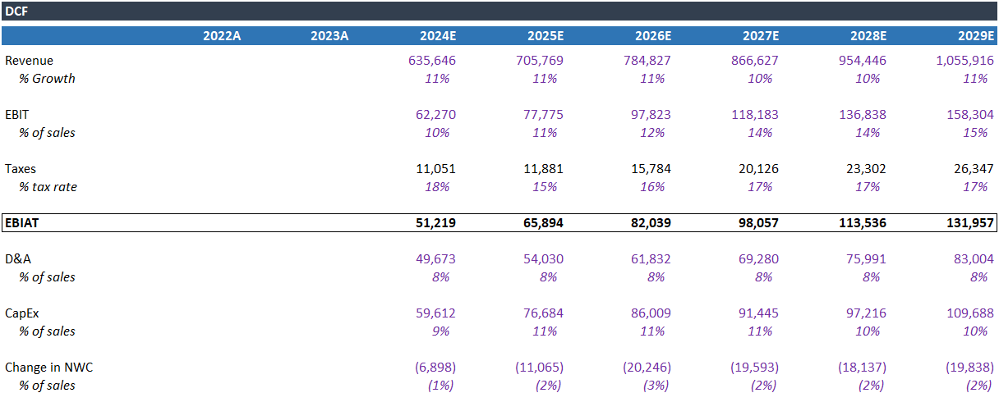

### Unlevered Free Cash Flow Calculation
- To calculate Unlevered FCF, we simply start with the EBIAT we calculated above, add back D&A, and subtract CapEx and the change in NWC:

```Excel
=L71+L73-L77-L80
```

## WACC Calculation
WACC, or the "Weighted Average Cost of Capital," is a measure of a firm's average after-tax cost of capital from all sources (common & preferred stock, bonds, and other forms of debt). The riskier a firm is, the more that investors would expect to be compensated for investing, so conceptually, WACC represents the minimum rate of return a company needs to generate to satisfy its investors.

To calculate WACC we use this equation:

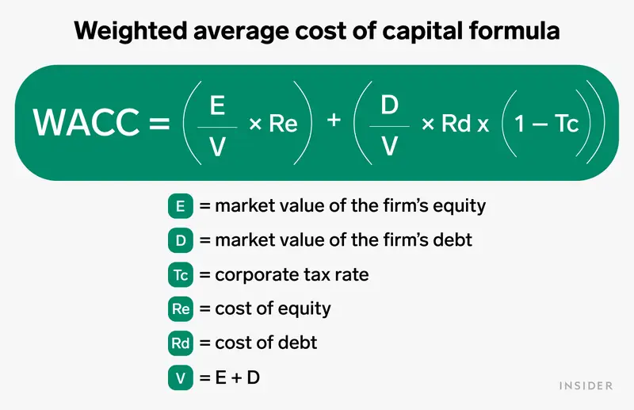

Here is how we find each element of the equation:

- Market Cap
    - This can be found on Yahoo Finance
- Risk-Free Rate
    - For this, we can use the 10-year treasury yield
- Beta
    - This can also be found on Yahoo Finance. This figure is a measure of the systematic risk of a stock. Essentially, how the stock moves in relation to the whole of the market
- Market Risk Premium
    - This can be found on the website of NYU Stern professor Aswath Damodaran (https://pages.stern.nyu.edu/~adamodar/)
- Debt
    - This can be found in Amazon's most recent 10-Q on the Balance Sheet item "Long-term Debt"
- Cost of Debt
    - One way to do this is to take the interest expense for the past 6 months, multiply it by two to estimate for a full year, and divide by the listed end-of-year debt total that we found previously.
    - [Another way to find this would be to find the weighted average YTM of all of the firm's outstanding debt.]
- Tax Rate
    - Use the tax rate from 2024E
- Cost of Equity
    - To calculate the cost of equity, we can use the Capital Asset Pricing Model (CAPM), where the cost of equity = Risk Free Rate + (Beta*Market Risk Premium)

With all of these figures, we can calculate WACC as shown below:
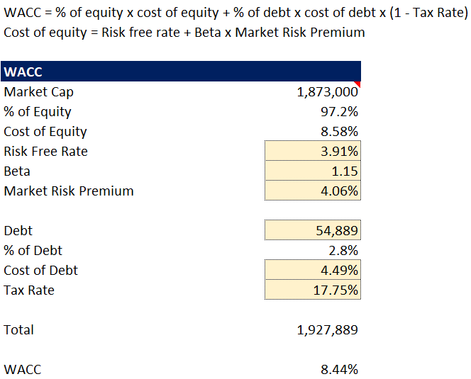

## Final Steps
Now that we have the WACC, we can add it back to our DCF sheet:
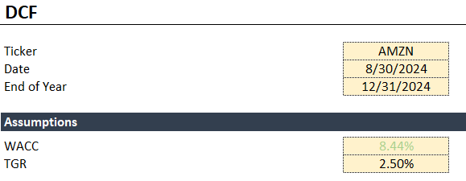

We will be using a TGR of 2.5%, which is in line with the growth rate of the United States.

While the standard discounting of free cash flows would simply use this equation:
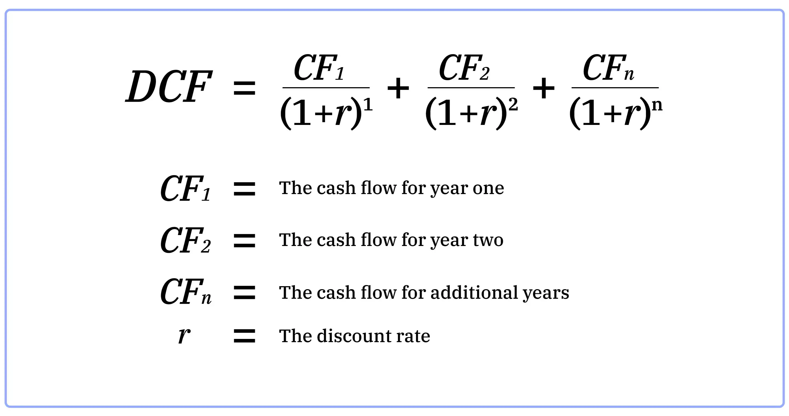

We will be using the "Mid Year Convention," where we assume that a firm receives its cash for the year in the middle of that year, instead of at the end. Since a company like Amazon would be making money all throughout the year, this method does a better job of accurately reflecting the actual present value of the future FCF that we are projecting for the firm.
    
- In order to do this, we first find the fraction of the year that is left in 2024. Since we are doing this DCF as of August 30, 2024, we have a third of the year left. Dividing this by two gets us our discount period. We can then add .5 to this to get to June of the next year. After that, we add 1 each time to get to June of the next four years after that:
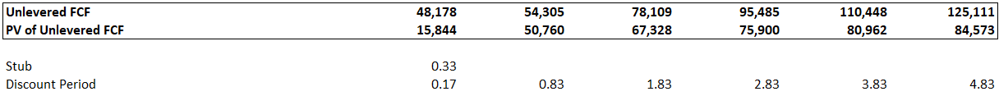

### Finding Terminal Value
In order to find the terminal value, or what we estimate the value of the business to be past our prediction period, we can use this equation:
[(Unlevered FCF*(1+TGR))/(WACC-TGR)]

- In this case, we use 2.5%, which is a standard growth rate to use for an American firm (the idea is that over the long run, we predict that the firm will grow in line with the wider country that it operates in).

- We then discount this terminal value to present value, using the discount rate we used in the final year of our projection.

- Adding this PV of terminal value to the sum of the PV of FCFs that we calculated above gives us the projected current Enterprise Value of the firm.

### Finding the Implied Share Price
#### Calculating Equity Value
- Finally, we can get Equity Value from Enterprise Value by adding back cash and subtracting out debt, both of which can be found in the consolidated balance sheet from the 10Q we used earlier.

#### Diluted Share Count Calculation
- Before we calculate the implied share price, we have to calculate the number of Fully Diluted Shares outstanding for the firm. Put simply, while Amazon has a listed total of shares outstanding in its 10Q, it also has Restricted Stock Units that would have a dilutive impact if exercised. Therefore, we can use this sheet to account for this impact before calculating a price per share:
    - The number of RSUs can be found in the 10Q
#### Calculating Implied Share Price
- Take the Fully Diluted Shares Outstanding figure that we calculated above and divide it by the Equity Value.
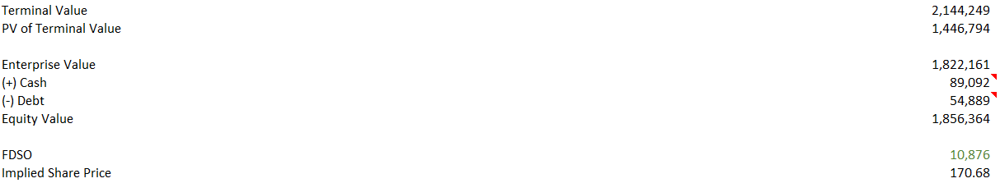
# What I Learned

From working on this project, I've learned many new Excel shortcuts, and reinforced my knowledge of valuation and DCFs. I hope to use this as a starting point for learning more advanced valuation techniques, like sum-of-parts DCFs, predicting multiple scenarios, levering and unlevering beta, and more!
